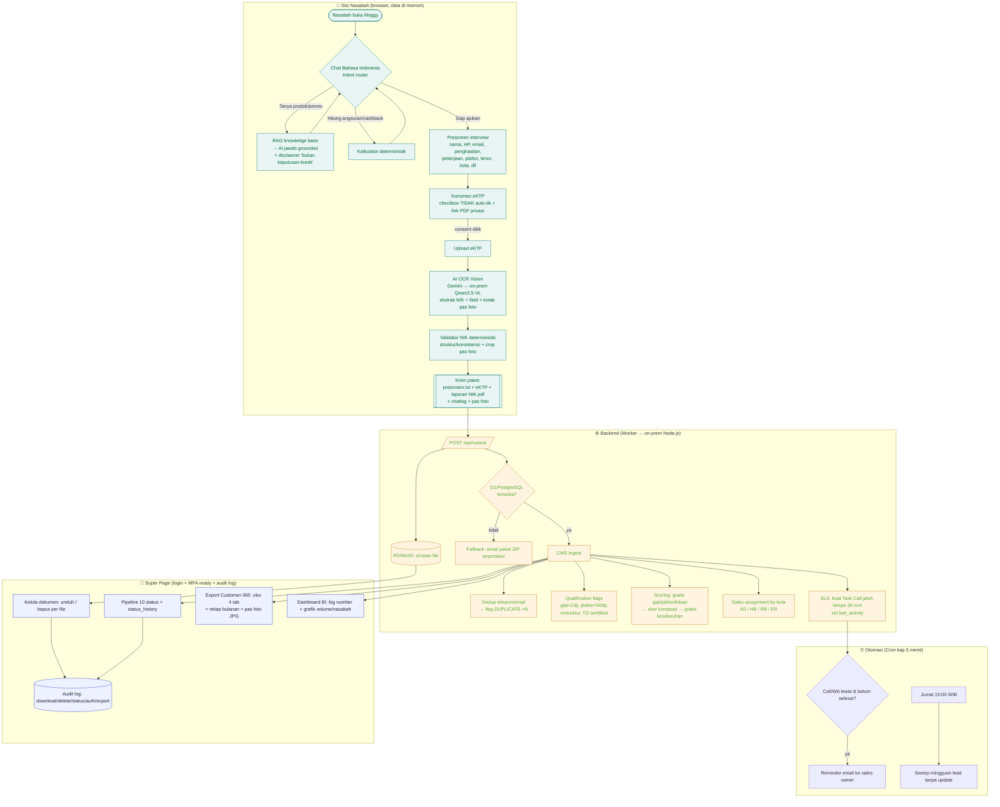
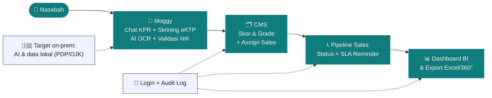

# Moggy — Flowcharts

Two diagrams (Mermaid). Render on GitHub/Notion, or paste into
<https://mermaid.live> to export PNG/SVG for slides.

---

## 1. Versi detail (end-to-end)

---

## 2. Versi ringkas (1 slide)

---

### Catatan
- **Versi detail** = untuk dokumentasi teknis / review internal.
- **Versi ringkas** = 5 kotak alur utama + 2 catatan (auth/audit, target on-prem)
  agar muat 1 slide dan mudah dibaca audiens non-teknis.
