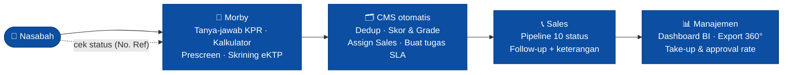
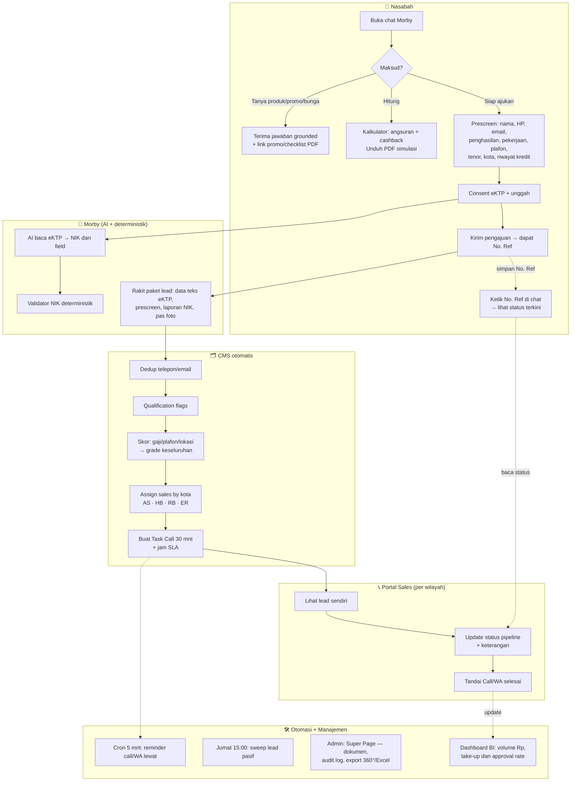
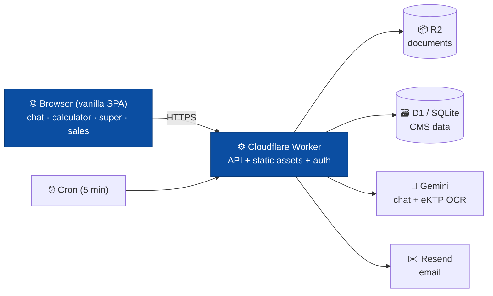
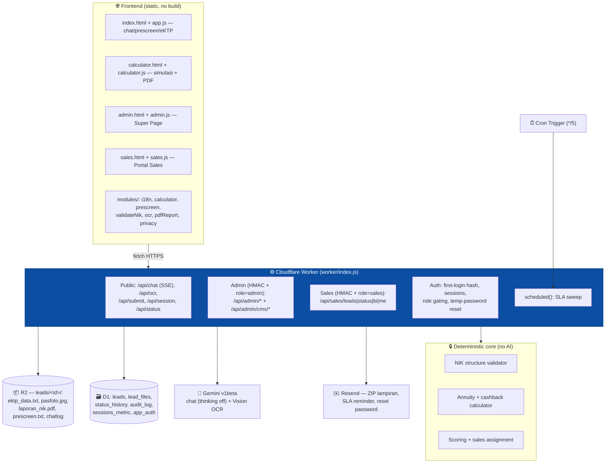

# How Morby Ver1.0 Works

Morby (the Bank Mortgage Buddy) is a browser-based GenAI KPR (mortgage) assistant
with eKTP/NIK screening and a built-in lead CMS. This document summarizes how it
works from two angles — **Business/Workflow** and **System/Architecture** — each
in a **high-level** and a **detailed** version.

Diagrams are Mermaid (render on GitHub/Notion or at <https://mermaid.live>).

---

## 1. Business / Workflow

### 1A. High-level

The whole funnel — from a customer question to a disbursed loan — runs in one
flow, mostly automated.

**In one line:** a customer chats → gets answers, a simulation, and completes a
prescreen + eKTP → the system automatically scores and routes the lead to the
right salesperson with SLA timers → sales work the pipeline → management sees
everything live. The customer can check their own status anytime with a reference
number.

### 1B. Detailed

Five actors, end to end. Everything a customer touches is on one chat screen; the
back office is the CMS and role-based portals.

**Key business rules (exact, from the brief):**
- **Scoring** = 40% income grade + 40% plafon grade + 20% location grade → overall A+…D.
- **Sales routing by city:** AS (Jabodetabek/Medan/Batam), HB (Surabaya/Gresik/Sidoarjo/Makassar/Bali), RB (Bandung/Yogya/Semarang), ER (others = escalation).
- **SLA:** Task Call due 30 min after a lead arrives; Task WA due 1 h after the call is done; overdue → email reminder; Friday 15:00 WIB weekly sweep.
- **Pipeline:** 10 statuses (uncontacted → slow_response → collect_data → submitted → approved → approved_not_disbursed → disbursed; plus drop_process / rejected / deal_other_bank).
- **Customer self-service:** a reference number returns first name + current status only (no other PII).

---

## 2. System / Architecture

### 2A. High-level

A single lightweight stack: a static browser app talking to one Cloudflare Worker
that fronts storage, AI, and email.

**In one line:** everything runs on Cloudflare — one Worker serves the pages and
the API, stores files in R2 and structured data in D1, calls Gemini for AI and
Resend for email, and a Cron trigger drives the SLA reminders. Production target
is the same design **on-premise** with self-hosted AI.

### 2B. Detailed

**Component notes:**
- **Frontend:** plain HTML/CSS/ES modules, no build step, strict CSP, self-hosted fonts; four pages share `styles.css` and `modules/`.
- **Worker:** one file routes public/admin/sales APIs and serves static assets; streams chat via SSE; runs the Cron `scheduled()` sweep.
- **Data:** R2 holds the per-lead documents (eKTP stored as **text only** + cropped pas foto — the full card scan is never stored); D1 holds the queryable CMS (only a **masked NIK**). Schema self-heals missing columns.
- **AI:** Gemini for chat (grounded on the knowledge base, thinking disabled for fast first token) and eKTP Vision OCR (JSON fields) — always checked by the deterministic NIK validator.
- **Auth/roles:** first-login password hashed in D1 (nothing in the repo); HMAC HttpOnly sessions carry role (admin/sales) and sales owner; every sensitive action is written to `audit_log`.
- **Deterministic core:** all money and identity logic (installments, cashback, NIK validity, scoring, routing) is code + the knowledge base — AI never invents numbers.
- **Production path:** the same architecture on-prem — MinIO (R2), PostgreSQL (D1), vLLM self-hosted models (Gemini), internal SMTP (Resend) — see `ON_PREM_ARCHITECTURE.md`.

---

### Summary table

| View | High-level | Detailed |
|---|---|---|
| **Business** | Nasabah → Morby → CMS auto (skor/assign) → Sales pipeline → Manajemen BI; self-service status by ref | 5 actors, exact scoring/routing/SLA/pipeline rules + customer status loop |
| **Architecture** | Browser SPA → 1 Cloudflare Worker → R2 + D1 + Gemini + Resend + Cron | Frontend pages/modules, public/admin/sales routes, D1 tables + R2 layout, AI + deterministic core, auth/roles, on-prem path |

*Internal summary for Morby Ver1.0 (POC). Compliance conclusions require DPO/Legal sign-off.*
